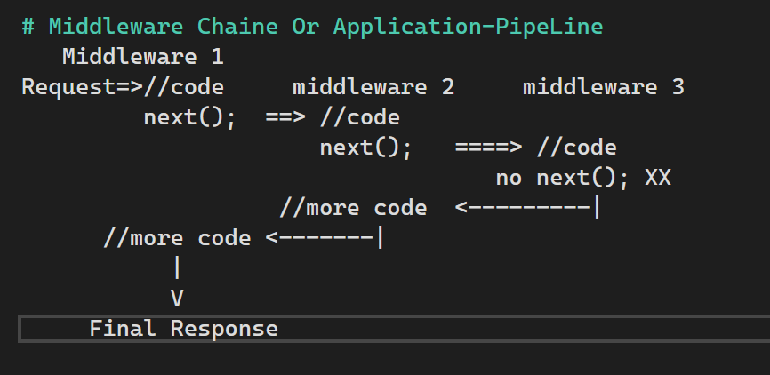

# MiddleWares:
==> the component in the Application Pipeline to handle requests and 
responses.

==> chained one after other and execute in the same sequence.

  Middleware1 ==> Middleware2 ==> Middleware3
  (Single Op)     (Single Op)

# Pros of using Middlewares:
لو فيه عملية عاوز تحذفها / تشيلها من غير ما تأثر على الباقى يبقى تحذف ال 
middleware
الخاص بالعملية دى

# Can be wriiten in 2 ways:
1 - Anonymous Method / Lambda Expression
2 - Class

# Ex1:
app.Run(async (HttpContext Context) => {
	await Context.Response.writeAsync ("Hello")
});

# The Formula of Writing this Part:
app.Run(async (HttpContext Context) => {
	// Code
});

# The Extension Method Run in (app.Run) means:
 - Run is used to execute a (Short circuiting) middleware that doesn't 
   Forward the (Request الطلب طبعاا) to the (Next Middleware).

# Middleware Chaine Or Application-PipeLine

# Note No.1:
By (Default) the middleware is of (Request Delegate) type.

# Custom Middleware Class:
==> Middleware class is used to ((separate)) the middleware logic (before/after logic)
from ((lambda expression)) to a separate / ((reusable class))

==> to define it as a class ==> First Thing is to (inherit from the predefined)
iterface called ((IMiddleware)) ==> this interface forces us to write one
method called InvokeAsync 

==> This InvokeAsync return a (task) type ==> that means it should be async method

==> This InvokeAsync Method receives 2 arguments 1- HttpContext
												 2- ResponseDelegate